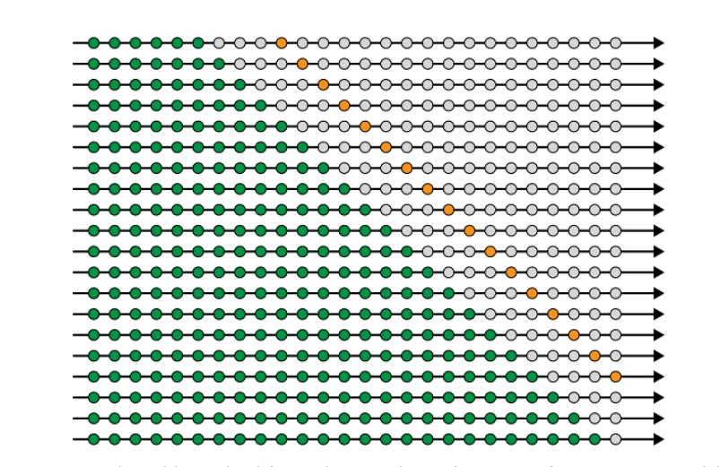

# Key Terms  
**Trend**  
A long-term increase or decrease in the data is referred to as a trend. It is not necessarily linear. It is the underlying pattern in the data over time.  

**Seasonal**  
When a series is influenced by seasonal factors i.e. quarter of the year, month or days of a week seasonality exists in the series. It is always of a fixed and known period. E.g. – A sudden rise in sales during Christmas, etc.

**Cyclic**  
When data exhibit rises and falls that are not of the fixed period we call it a cyclic pattern. For e.g. – duration of these fluctuations is usually of at least 2 years.  

**Stationarity**  
Achieved by:
1. Differencing  
2. Log or square-root to stabilize non-constant variance  
3. Curve-fitting (kernel)  

**Wold's Theorem**  
Every covariance-stationary time-series can be written as a sum of two time-series: one deterministic and one stationary  

**Correlation**  
Degree of similarity between two series (can be the same series at different points)

**Autocorrelation Function**
Correlation of a signal with a delayed copy of itself, is the similarity between observationsn as a function of the time lag between them    
ACF of a periodic function has the same periodicity of the original process  
All time-series have unity ACF at lag 0  
White noise has a near-zero ACF 

**Partial Autocorrelation**  
For a given lag, is the *partial* correlation of the time series with itself at the given lag given all information between the two points in time.  
Is able to visualise "true" non-redundant informative correlations for specific lag

# Statistical Time Domain
## General Information
### Advantages  
- Simple and transparent, hence easily explainable
- Good results on small data
- Perform comparible well (with respect to more advanced models) without the risk of overfitting
- Simple to generate forecasts 

### Disadvantages 
- May not improve in performance given larger data
- Focus on point estimates of mean values as opposed to features of distribution thereby limited exxpression of uncertainty  
- Cannot handle data with nonlinear dynamics

## Auto-Regressive Integrated Model Average  
Is a sum of present and past **series** terms  

$$
y_t = \mu + e_t + \theta_1\times y_{t-1} + ... + \theta_q\times y_{t-q}\\
$$
### Where to use  
- Stationary data: properties of series does not depend on actual time captured  
- Trend and seasonality removed
- Model exhibits *lag-n* autocorrelation (n being model order) to error terms  
- Series is a sum of linear multiples of its past values pluse white noise  
- Series has mean zero (or is zeroed by mean-subtraction)

### Limitations  
- Non-stationary for parameter values greater than one, meaning model will not converge or is *explosive*

### Parameters  
**p**: Number of lag observations (lag order)  
**d**: number of times raw observations are differenced  
**q**: size of moving average window  
- Should be used for short-term forecasts **only**  

Number of lags determined by autocorrelation analysis which examines serial dependence  
Cylic behaviour of series found by spectral analysis to describe how variatoin in a time series may be accounted for by cyclic components  
Trend estimation and decomposition performed for seasonl adjustment

## Moving Average Model  
*NOT a moving average of actual series values*  
Is a sum of present and past **error terms** iid mean $0$  
$$
y_t = \mu + e_t + \theta_1\times e_{t-1} + ... + \theta_q\times e_{t-q}\\
$$
Mean and variance finite and invariant with time since expectation of iid error terms are zero, and variance of the sum of terms is constant (iid variables have zero covariance)
Forecasts converge to eh mean of the process

### Where to Use
- Model exhibits *lag-n* autocorrelation (n being model order) to error terms  
- Series is a sum of linear multiples of its past values pluse white noise  
- Series has mean zero (or is zeroed by mean-subtraction)

### Limitations  
- Forecasting past the model order results in a mean  

## Auto-Regressive Moving-Average  
General combination of the previous two  
$$
y_t = \mu(1-\sum_i^p \theta_i) + \epsilon + \theta_1\times y_{t-1} + ... + \theta_q\times y_{t-p} \theta_1\times e_{t-1} + ... + \theta_q\times e_{t-q}
$$

### Where to Use
- Series exhibits both ACF and PACF lags with non-sharp cutoff  
- AR and MA parameters have no common factors to avoid over-parameterization  
- Model can be expressed as a one-sided linear process (is casual)  

## ARIMA - AR Integrated MA Model
Does not assume stationarity of time series, implicitly converts time series into seris of changes in values over time by calculating pairwise differences of adjacent point.  
Model should not exhibit large ACF and PACFs, this is an indicator of an under-specified models

### Parameters  
Typically specified as 
$$
ARIMA(p, d, q)
$$
**d:** time-window used for differencing  
**p:** AR order  
**q:** MA order  

### Common ARIMA Models  
- ARIMA(0, 0, 0) is a white noise model.
- ARIMA(0, 1, 0) is a random walk, and ARIMA(0, 1, 0) with a nonzero constant is a random walk with drift.
- ARIMA(0, 1, 1) is an exponential smoothing model, and an ARIMA(0, 2, 2) is the same as Holt’s linear method, which extends exponential smoothing to data with a trend, so that it can be used to forecast data with an underlying trend.  

## Vector Autoregression  
Each variable is modeled as a linear combination of past values of itself and the past values of other variables in the system, can be used to test this hypothesis

$$
y_{t} = \textbf{c} + \sum_{i=1}^{p} \textbf{A}_{i}\textbf{y}_{t-i} + \textbf{u}_t
$$

### Where to Use  
- At least two time, non-independent time-series  
- All series are statioary  

### Considerations  
- Complexity increases quadratically, *information content* of a VAR model should be checked

# Evaluating Time-Series Models  
*Gold standard: backtesting with trainning, validation and testin periods that roll forward*  
No reason to have a model that doesn't beat a null model 
$$
y_t = y_{t-1}
$$
In backtesting, a model is developed for one set of dates, or a range of dates, but then it is tested extensively on historical data, preferably representing the full range of possible conditions and variability

Following image: green is training, orange is test/validation data

Cannot randomly select points for validation since model's recongition of autoregressive components will be undetermined. 
Distribution of model output should match distribution of values being forecasted